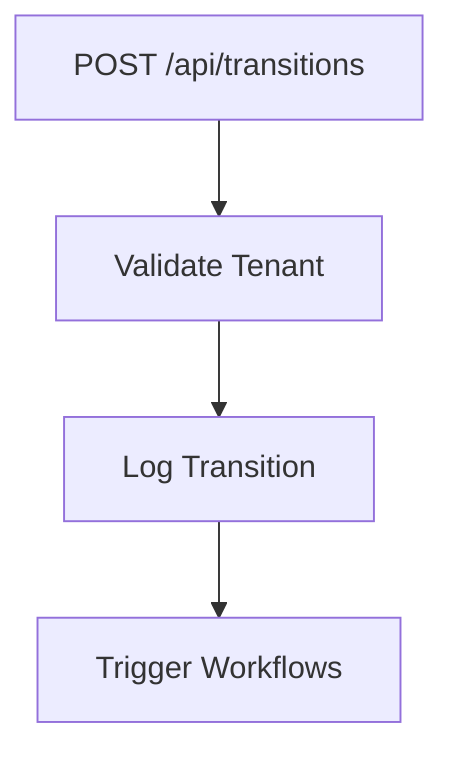
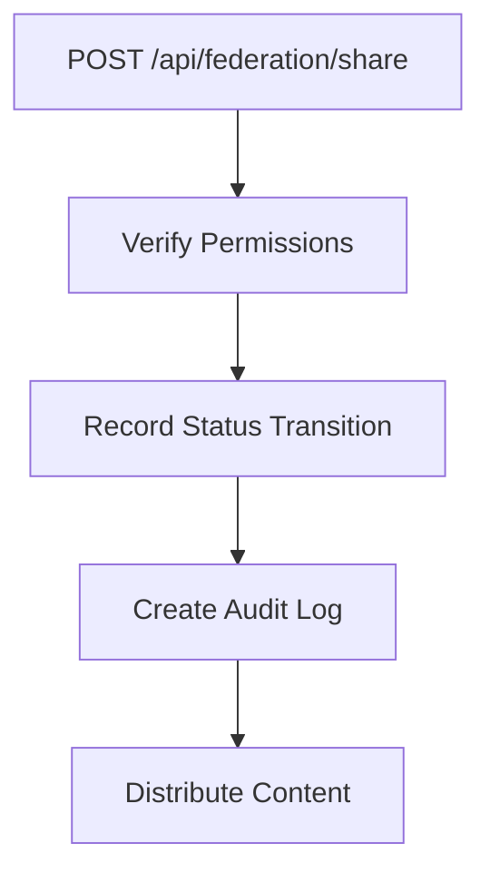

# Phase 9 Implementation Plan

## Database Schema Changes

### Status Transitions Table
```sql
CREATE TABLE status_transitions (
    id INT AUTO_INCREMENT PRIMARY KEY,
    entity_type VARCHAR(255) NOT NULL,
    entity_id BIGINT NOT NULL,
    from_status VARCHAR(255) NOT NULL,
    to_status VARCHAR(255) NOT NULL,
    transition_time DATETIME DEFAULT CURRENT_TIMESTAMP,
    reason TEXT,
    tenant_id INTEGER NOT NULL,
    CONSTRAINT fk_status_transitions_tenant FOREIGN KEY (tenant_id) REFERENCES tenants(id)
);
```

### Federation Audit Log
```sql
CREATE TABLE federation_audit_log (
    id SERIAL PRIMARY KEY,
    source_site_id INTEGER NOT NULL,
    target_site_id INTEGER NOT NULL,
    content_id VARCHAR(255) NOT NULL,
    action VARCHAR(50) NOT NULL,
    status VARCHAR(50) NOT NULL,
    transition_id INTEGER REFERENCES status_transitions(id),
    timestamp TIMESTAMP DEFAULT CURRENT_TIMESTAMP,
    CONSTRAINT fk_source_site FOREIGN KEY (source_site_id) REFERENCES sites(id),
    CONSTRAINT fk_target_site FOREIGN KEY (target_site_id) REFERENCES sites(id)
);
```

## API Endpoints

### Status Transition API


### Federation API


## Migration Sequence

1. Create status_transitions table (Migration_0005)
2. Add federation_audit_log table (Migration_0006)
3. Update existing content tables with status fields (Migration_0007)

## Testing Approach

1. Unit tests for transition validation
2. Integration tests for API endpoints
3. End-to-end tests for federation workflow
4. Rollback verification tests

## Rollback Procedures

Each migration will include:
- Atomic transaction blocks
- Comprehensive error logging
- Verified rollback SQL
- Web-accessible test endpoints