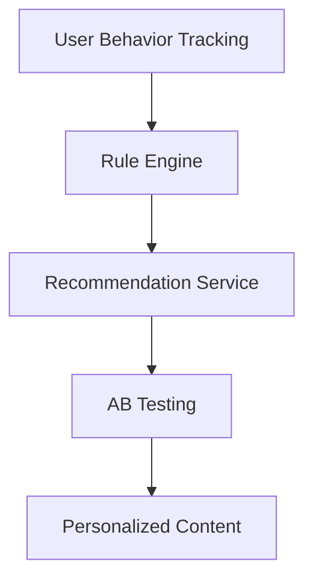
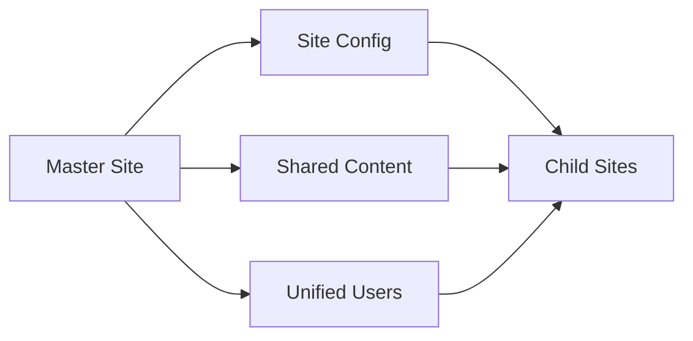
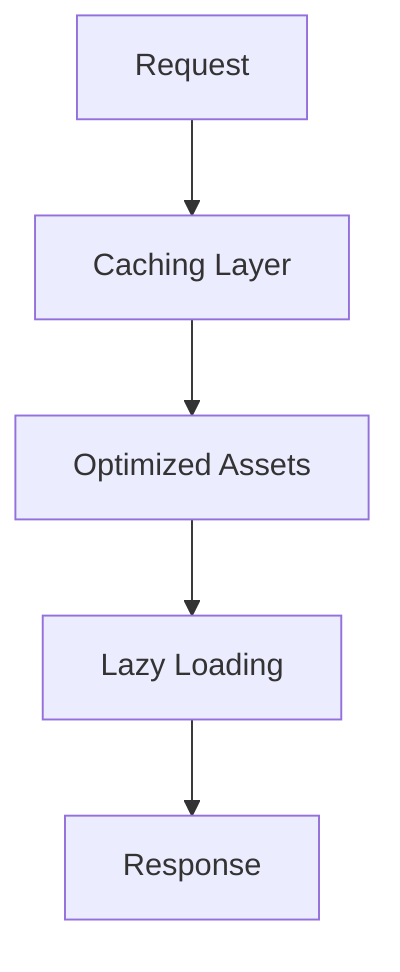
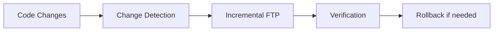

# Implementation Plan for Phases 14-17

## Phase 14: Content Personalization Engine

1. **User Behavior Tracking**
   - Extend analytics events table
   - Add real-time tracking endpoints
   - Implement session-based tracking

2. **Recommendation Algorithms**
   - Collaborative filtering
   - Content-based recommendations
   - Hybrid approach

3. **Personalization Rules Engine**
   - Rule priority system
   - Multi-site rule inheritance
   - Visual rule builder

4. **A/B Testing Framework**
   - Variant allocation
   - Statistical significance tracking
   - Automated winner selection

## Phase 15: Multi-site Management

1. **Centralized Configuration**
   - Hierarchical config inheritance
   - Site-specific overrides
   - Config versioning

2. **Shared Content Pools**
   - Global content repository
   - Site-specific content gates
   - Cross-site content recommendations

3. **Cross-site Analytics**
   - Aggregate reporting
   - Site comparison tools
   - Shared audience segments

4. **Unified User Management**
   - Single sign-on
   - Role inheritance
   - Cross-site permissions

## Phase 16: Performance Optimization

1. **Advanced Caching**
   - Multi-level caching
   - Cache invalidation rules
   - Personalized content caching

2. **Asset Optimization**
   - Automated minification
   - Versioned assets
   - CDN integration

3. **Database Optimization**
   - Query analyzer
   - Index recommendations
   - Read replicas

4. **Lazy Loading**
   - Component-based loading
   - Priority queues
   - Predictive prefetching

## Phase 17: Deployment Automation

1. **Incremental FTP Deployment**
   - Change detection
   - Minimal file transfers
   - Connection pooling

2. **Change Tracking**
   - Deployment journal
   - Change impact analysis
   - Notification system

3. **Rollback Mechanism**
   - Version snapshots
   - One-click rollback
   - Dependency checking

4. **Staging Sync**
   - Environment comparison
   - Selective synchronization
   - Data sanitization

## Implementation Requirements
- **Shared Hosting Compatibility**
  - Pure PHP implementation
  - No background processes
  - File-based operations

- **Backward Compatibility**
  - Migration scripts
  - Feature flags
  - Deprecation warnings