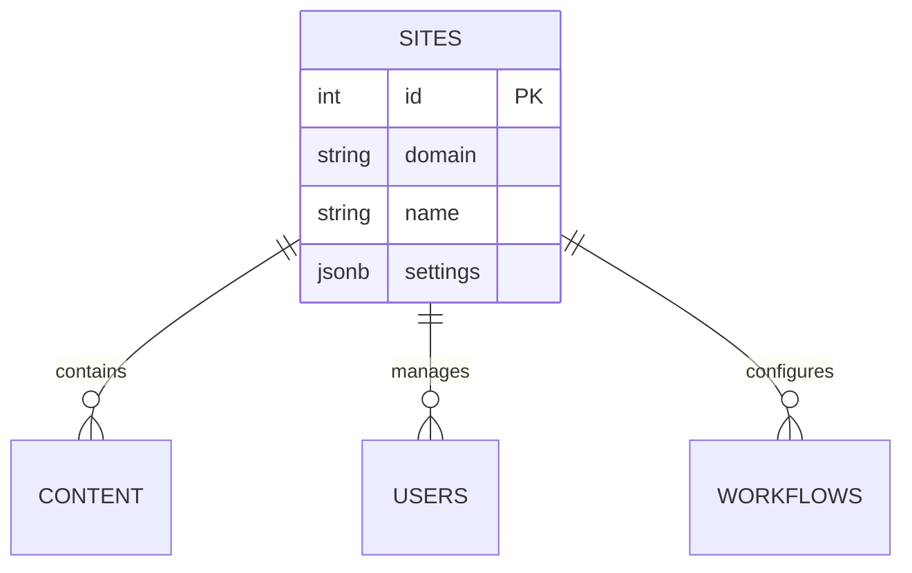
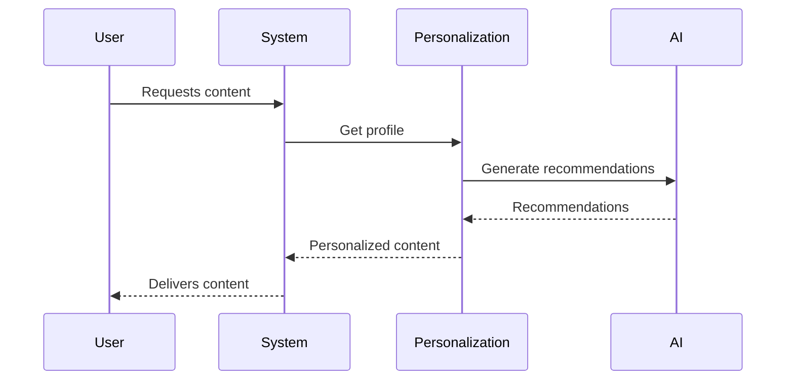
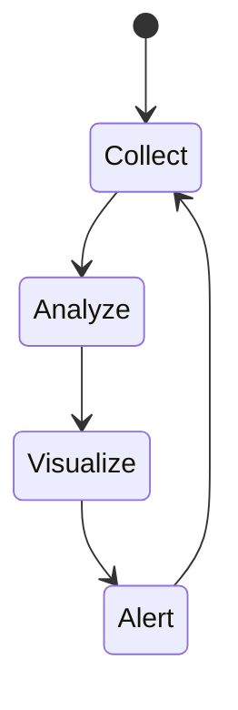

# Phased Implementation Plan (24-28)

## Phase 24: Multi-site Management

**Database Schema:**
- `sites` table (id, domain, name, settings)
- `site_users` (site_id, user_id, role)
- `site_content` (site_id, content_id)

**API Endpoints:**
- GET /sites → List all sites
- POST /sites → Create new site
- PUT /sites/{id} → Update site
- GET /sites/{id}/content → Get site content

**UI Components:**
- Site switcher dropdown
- Site management dashboard
- Site configuration wizard

## Phase 25: Advanced Personalization

**Database Schema:**
- `user_profiles` (user_id, preferences, behavior_patterns)
- `content_recommendations` (content_id, user_id, score)
- `personalization_rules` (rule_name, conditions, actions)

**Integration Points:**
- Existing analytics system
- Content API
- AI services

## Phase 26: Content Federation
**Key Components:**
1. Federation Service
2. Content Synchronization
3. Conflict Resolution

**Database Schema:**
- `federated_content` (source_id, local_id, metadata)
- `sync_status` (content_id, last_sync, status)

## Phase 27: AI Content Optimization
**Workflow:**
1. Content Analysis
2. Optimization Suggestions
3. A/B Testing
4. Performance Tracking

**UI Components:**
- Content scoring dashboard
- Optimization panel
- A/B test configuration

## Phase 28: Performance Monitoring

**Metrics Tracked:**
- API response times
- Database query performance
- Content delivery metrics
- AI processing times

## Implementation Sequence
1. Database migrations (all phases)
2. Core services implementation
3. API endpoints
4. UI components
5. Integration testing
6. Performance optimization