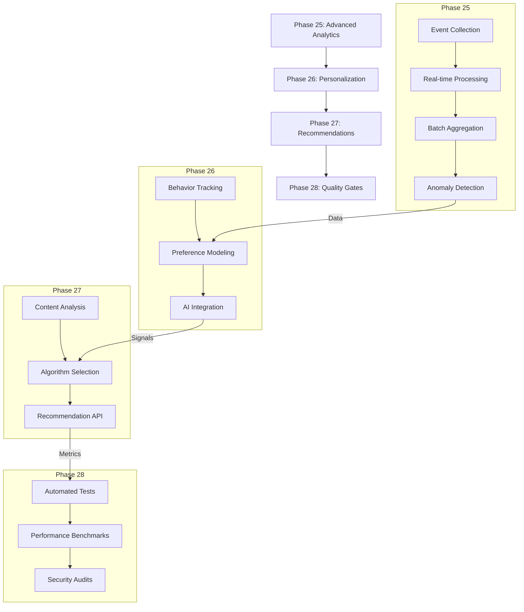

# Phases 25-28 Implementation Plan

## Workflow Overview

## Technical Specifications

### Phase 25: Advanced Analytics
- **Event Collection**: Redis-based event ingestion
- **Real-time Processing**: PHP workers with WebSocket updates
- **Batch Aggregation**: Nightly cron jobs
- **Anomaly Detection**: Statistical modeling service

### Phase 26: Personalization Engine  
- **Behavior Tracking**: Cookie-less fingerprinting
- **Preference Modeling**: AI clustering algorithms
- **AI Integration**: REST endpoints for model updates

### Phase 27: Content Recommendations
- **Content Analysis**: NLP processing pipeline
- **Algorithm Selection**: Hybrid approach (collaborative + content-based)
- **Recommendation API**: Cached responses with real-time updates

### Phase 28: Quality Gates
- **Automated Tests**: 85% coverage requirement
- **Performance Benchmarks**: <500ms response time SLA
- **Security Audits**: OWASP compliance checks

## Integration Requirements
1. Redis cluster for real-time data
2. Shared authentication middleware
3. Unified logging format
4. Common error handling

## Quality Control Checklist
- [ ] Unit test coverage >85%
- [ ] Integration tests for all workflows
- [ ] Performance SLA met (p95 <500ms)
- [ ] Security audit passed
- [ ] Documentation complete