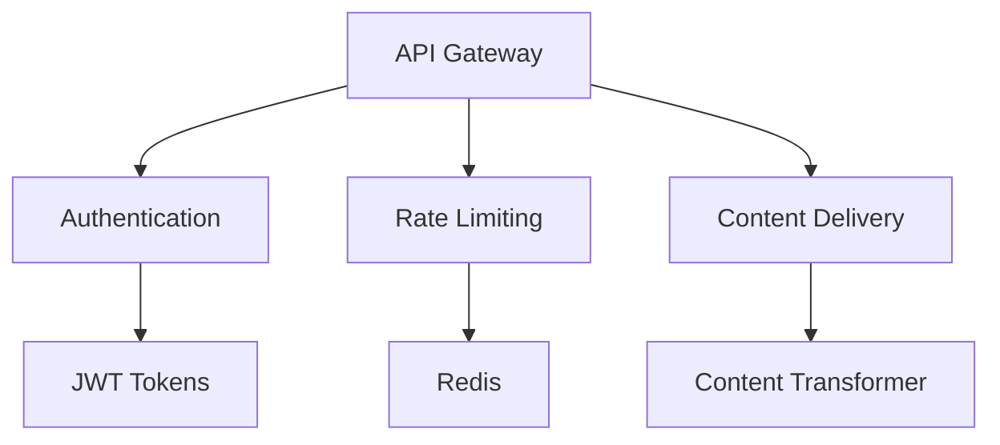
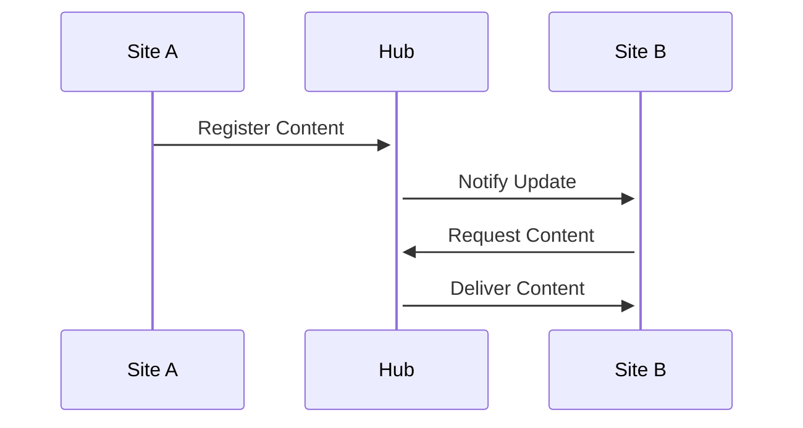
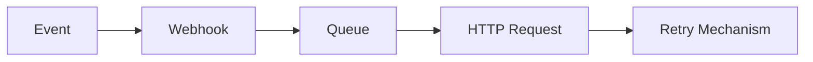
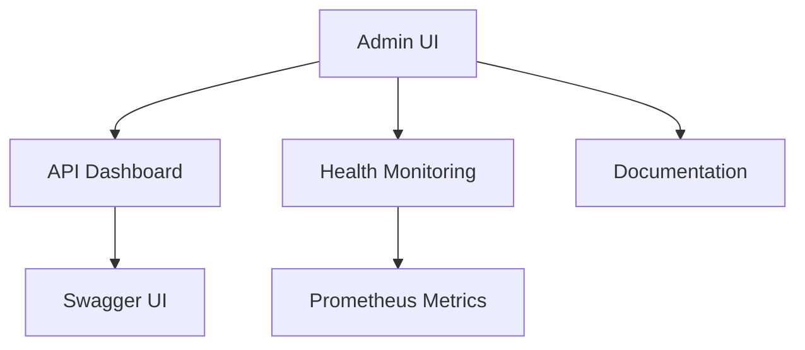

# Phases 8-11 Implementation Plan

## Phase 8 - Headless API System

### RESTful JSON Endpoints
- Extend existing `api/v1/routes.php`
- New endpoints:
  - `/api/v2/content` (CRUD operations)
  - `/api/v2/auth` (token management)
  - `/api/v2/rate-limits` (view current limits)
- JSON:API specification compliance

### Authentication Layer
- JWT-based authentication
- Token refresh mechanism
- API key management interface

### Rate Limiting
- Redis-based rate limiting
- Tiers:
  - Guest: 100 requests/hour
  - User: 500 requests/hour  
  - Admin: 2000 requests/hour

## Phase 9 - Content Federation

### Cross-site Sharing
- New `federated_content` table:
  - `source_site_id`
  - `content_id`  
  - `last_synced_at`
  - `sync_status`
- WebSub protocol implementation
- Content signing with JWT

### Update Propagation
- Webhook notifications
- Batch processing for large updates
- Conflict resolution system

## Phase 10 - Webhook System

### Event Triggers
- Content events (create/update/delete)
- User events (login/role change)
- System events (maintenance/updates)

### Retry Mechanism
- Exponential backoff (1m, 5m, 15m, 1h)
- Dead letter queue after 3 failures
- Admin notification dashboard

## Phase 11 - Final Integration

### Unified Admin Interface
- Single-page application
- API management console
- Real-time monitoring

### Documentation
- Swagger/OpenAPI specs
- Interactive API explorer
- Markdown-based guides

## Implementation Timeline

1. Week 1: API System Core
2. Week 2: Federation Protocol
3. Week 3: Webhook System
4. Week 4: Final Integration