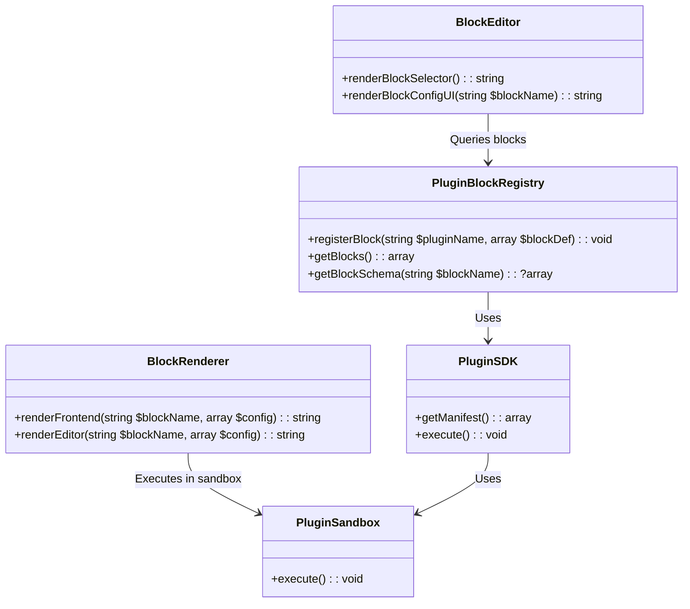

# Plugin-Defined Blocks Implementation Plan

## Architecture Overview


## Implementation Steps

1. **Create PluginBlockRegistry**
   - Extend ModuleRegistry to handle block definitions
   - Store block metadata (label, icon, schema, handlers)
   - Provide methods for editor UI to query available blocks

2. **Update Plugin Manifest**
   - Add `blocks` section to plugin.json:
   ```json
   "blocks": {
     "my_block": {
       "label": "My Block",
       "icon": "fa-icon",
       "schema": {
         "type": "object",
         "properties": {
           "text": {"type": "string"}
         }
       },
       "handlers": {
         "php": "MyBlockHandler::render",
         "js": "my-block.js"
       }
     }
   }
   ```

3. **Implement Block Rendering**
   - Frontend: PHP handler executed via PluginSandbox
   - Editor: Auto-generated UI from JSON schema
   - Custom UI: Optional JS handler for complex cases

4. **Integrate with BlockEditor**
   - Query PluginBlockRegistry for available blocks
   - Render block selector with plugin blocks
   - Handle block configuration

5. **Security Implementation**
   - All plugin PHP code runs in PluginSandbox
   - JS handlers loaded with content security policy
   - Schema validation before rendering

## File Structure Changes
```
core/
  PluginBlockRegistry.php (new)
  blocks/
    BlockRenderer.php (new)
    SchemaToForm.php (new)
```

## Next Steps
1. Implement PluginBlockRegistry
2. Update PluginSDK to handle block registration
3. Extend BlockEditor UI
4. Create documentation for plugin developers