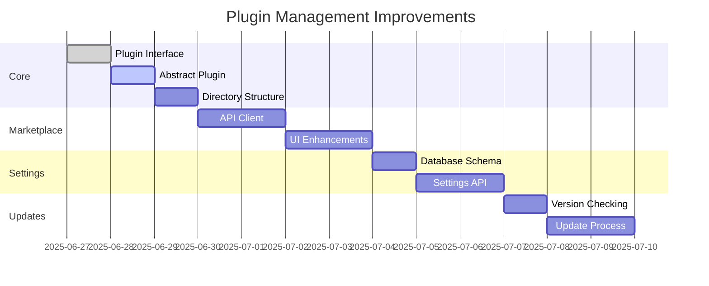

# Plugin Management Module Improvements

## Phase 1: Core Architecture
1. **Plugin Interface**
   - Create `PluginInterface.php` in `admin/core/`
   - Define required methods:
     - `activate()`
     - `deactivate()` 
     - `getSettings()`
     - `registerHooks()`
   - Create `AbstractPlugin.php` with common functionality

2. **Directory Structure**
   - Standardize plugin directory layout:
     ```
     /plugins/
       {plugin-name}/
         bootstrap.php
         plugin.json
         assets/
         includes/
         views/
     ```

## Phase 2: Marketplace Integration
1. **API Client**
   - Create `PluginMarketplaceClient.php`
   - Implement methods:
     - `getAvailablePlugins()`
     - `getPluginDetails()`
     - `downloadPlugin()`

2. **UI Enhancements**
   - Add plugin categories
   - Implement search/filter
   - Add ratings/reviews

## Phase 3: Settings Management
1. **Database Schema**
   - Add `plugin_settings` table
   - Migration for existing plugins

2. **Settings API**
   - Create `PluginSettingsService.php`
   - Methods:
     - `getSettings()`
     - `saveSettings()`
     - `validateSettings()`

## Phase 4: Update Mechanism
1. **Version Checking**
   - Add version check to PluginService
   - Scheduled background checks

2. **Update Process**
   - One-click updates
   - Rollback capability
   - Changelog display

## Implementation Plan



## Required Resources
1. Database migrations:
   - `2025_07_04_0001_create_plugin_settings.php`
   - `2025_07_04_0002_add_version_columns.php`

2. New files:
   - `admin/core/PluginInterface.php`
   - `admin/core/AbstractPlugin.php`
   - `admin/core/PluginMarketplaceClient.php`
   - `admin/core/PluginSettingsService.php`

3. Modified files:
   - `admin/core/PluginService.php`
   - `admin/plugins-marketplace.php`
   - `admin/plugin-install.php`
   - `admin/plugin-uninstall.php`