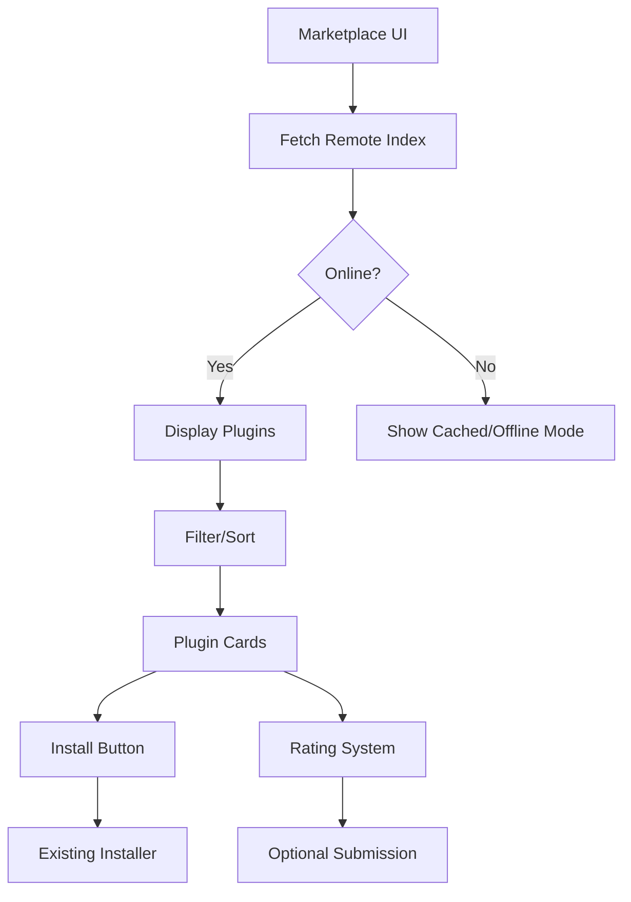

# Plugin Marketplace Implementation Plan

## Overview
Extend the CMS admin panel with a plugin marketplace that allows browsing, installing, and rating plugins from a remote JSON-based repository.

## Architecture



## Components

### 1. Marketplace UI
- Location: `admin/plugins/marketplace.php`
- Features:
  - Plugin cards with name, author, version, description
  - Filtering by category/compatibility
  - Sorting options
  - Install/update buttons

### 2. Remote Plugin Index
- JSON format:
```json
{
  "plugins": [
    {
      "name": "PluginName",
      "version": "1.0.0",
      "description": "...",
      "author": "...",
      "compatibility": "1.0+",
      "categories": ["seo", "analytics"],
      "rating": 4.5,
      "download_url": "https://example.com/plugins/pluginname.zip"
    }
  ]
}
```

### 3. Backend Services
- `RemoteFetcher.php`: Handles JSON fetching with caching
- `PluginCompatibilityChecker.php`: Verifies system requirements
- `RatingService.php`: Manages optional rating submissions

## Implementation Steps

1. **UI Extension**
   - Add marketplace tab to existing plugin manager
   - Create new view templates
   - Implement client-side filtering/sorting

2. **Remote Integration**
   - Create fetcher service with caching
   - Add configuration for index URL
   - Implement offline fallback

3. **Installation Flow**
   - Modify existing installer to handle remote ZIPs
   - Add verification steps for remote packages

4. **Rating System**
   - Create optional rating submission endpoint
   - Add local storage for ratings when offline

## Database Changes
```sql
CREATE TABLE IF NOT EXISTS plugin_ratings (
  id INT AUTO_INCREMENT PRIMARY KEY,
  plugin_name VARCHAR(255) NOT NULL,
  user_id INT,
  rating TINYINT NOT NULL,
  review TEXT,
  created_at TIMESTAMP DEFAULT CURRENT_TIMESTAMP,
  FOREIGN KEY (plugin_name) REFERENCES plugins(name)
);

CREATE TABLE IF NOT EXISTS cached_plugins (
  id INT AUTO_INCREMENT PRIMARY KEY,
  name VARCHAR(255) NOT NULL,
  data JSON NOT NULL,
  last_updated TIMESTAMP DEFAULT CURRENT_TIMESTAMP
);
```

## Security Considerations
- Verify plugin ZIP checksums
- Sandbox plugin installation
- Rate limit rating submissions
- CSRF protection for all actions