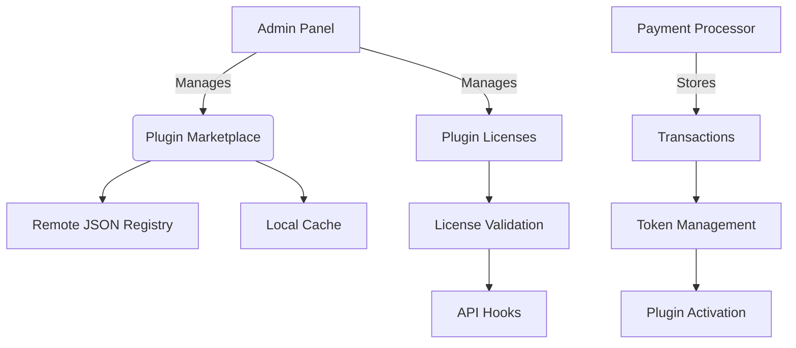

# Plugin Monetization System Architecture

## System Diagram (Mermaid)


## JSON Schema for Plugin Registry
```json
{
  "$schema": "http://json-schema.org/draft-07/schema#",
  "type": "object",
  "properties": {
    "id": {"type": "string"},
    "name": {"type": "string"},
    "version": {"type": "string"},
    "author": {"type": "string"},
    "description": {"type": "string"},
    "compatibility": {
      "type": "object",
      "properties": {
        "cms_version": {"type": "string"},
        "php_version": {"type": "string"}
      }
    },
    "pricing": {
      "type": "object",
      "properties": {
        "type": {"enum": ["free", "token", "premium"]},
        "price": {"type": "number"},
        "tokens_required": {"type": "integer"},
        "subscription": {"type": "boolean"}
      }
    },
    "categories": {"type": "array", "items": {"type": "string"}},
    "screenshots": {"type": "array", "items": {"type": "string"}},
    "dependencies": {"type": "array", "items": {"type": "string"}}
  },
  "required": ["id", "name", "version", "compatibility"]
}
```

## Database Schema Changes
```sql
-- plugins table (extend existing)
ALTER TABLE plugins ADD COLUMN pricing_type ENUM('free', 'token', 'premium') NOT NULL DEFAULT 'free';

-- New tables
CREATE TABLE plugin_licenses (
    id VARCHAR(36) PRIMARY KEY,
    plugin_id VARCHAR(255) NOT NULL,
    tenant_id VARCHAR(255) NOT NULL,
    license_key VARCHAR(255) NOT NULL,
    activation_date DATETIME,
    expiration_date DATETIME,
    is_active BOOLEAN DEFAULT FALSE,
    token_balance INT DEFAULT 0,
    FOREIGN KEY (plugin_id) REFERENCES plugins(id),
    FOREIGN KEY (tenant_id) REFERENCES tenants(id)
);

CREATE TABLE plugin_transactions (
    id VARCHAR(36) PRIMARY KEY,
    license_id VARCHAR(36) NOT NULL,
    amount DECIMAL(10,2) NOT NULL,
    currency VARCHAR(3) DEFAULT 'USD',
    transaction_date DATETIME DEFAULT CURRENT_TIMESTAMP,
    payment_method VARCHAR(50),
    tokens_purchased INT,
    FOREIGN KEY (license_id) REFERENCES plugin_licenses(id)
);

CREATE TABLE plugin_activations (
    id VARCHAR(36) PRIMARY KEY,
    license_id VARCHAR(36) NOT NULL,
    activation_date DATETIME DEFAULT CURRENT_TIMESTAMP,
    deactivation_date DATETIME,
    ip_address VARCHAR(45),
    hostname VARCHAR(255),
    FOREIGN KEY (license_id) REFERENCES plugin_licenses(id)
);
```

## File Structure for New Components
```
plugins/
  monetization/
    LicenseManager.php
    PaymentProcessor.php
    TokenService.php
    validators/
      FreePluginValidator.php
      TokenPluginValidator.php
      PremiumPluginValidator.php
admin/
  controllers/
    PluginMonetizationController.php
  views/
    plugins/
      purchase.php
      license.php
      tokens.php
```

## Integration Points
1. Extend `PluginMarketplaceController` to handle:
   - Purchase flows
   - License management
   - Token transactions

2. Modify `ModuleRegistry` to:
   - Check license validity before loading plugins
   - Track token usage for token-activated plugins

3. Add hooks in `PluginSDK` for:
   - License validation
   - Token deduction
   - Usage tracking

4. Extend admin UI to include:
   - Purchase screens
   - License management
   - Token balance display