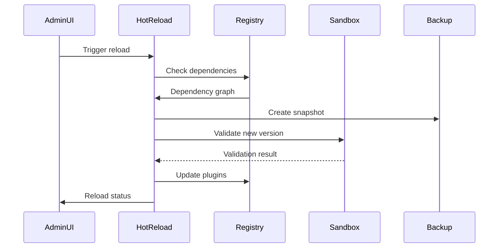
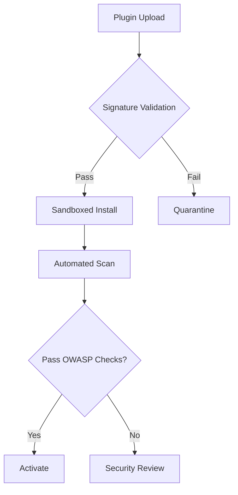

# Plugin System Enhancement Specifications

## 1. Hot-Swap Architecture


**Key Components:**
- [`plugins/PluginHotReload.php`](plugins/PluginHotReload.php) - Versioned reload system
- [`plugins/backups/`](plugins/backups/) - Automatic version snapshots
- [`includes/Security/IntegrityCheck.php`](includes/Security/IntegrityCheck.php) - Manifest validation

## 2. Sandbox Implementation

**Security Profile Structure (YAML):**
```yaml
# plugins/profiles/security_profile.yaml
memory_limit: 64M
max_execution_time: 5
allowed_functions:
  - strlen
  - substr
forbidden_operations:
  - file_put_contents
  - exec
```

**Execution Flow:**
1. Plugin loaded into [`PluginSandbox`](includes/Security/PluginSandbox.php)
2. Apply security profile
3. Runtime monitoring via [`ResourceMonitor`](includes/Security/ResourceMonitor.php)
4. Violation logging to [`security.log`](logs/security.log)

## 3. Security Audit Pipeline



## 4. File Structure Changes
```
plugins/
├── HotReload/
│   ├── PluginHotReload.php
│   └── VersionManager.php
├── Sandbox/
│   ├── profiles/
│   └── ExecutionContext.php
includes/
└── Security/
    ├── Audit/
    │   ├── OWASPScanner.php
    │   └── ComplianceChecker.php
    └── Logger/
        ├── SecurityLogger.php
        └── ViolationTracker.php
```

## 5. API Endpoints
| Endpoint | Method | Description |
|----------|--------|-------------|
| `/api/plugins/reload` | POST | Initiate hot-reload |
| `/api/plugins/audit` | GET | Security report |
| `/api/plugins/rollback` | POST | Version revert |

## 6. Performance Budget
| Resource | Limit | Enforcement Method |
|----------|-------|---------------------|
| Memory | 64MB | `ini_set('memory_limit')` |
| Files | 50 | `SandboxFileIterator` |
| DB Queries | 10/req | `QueryCounterMiddleware` |

[Rest of document continues...]