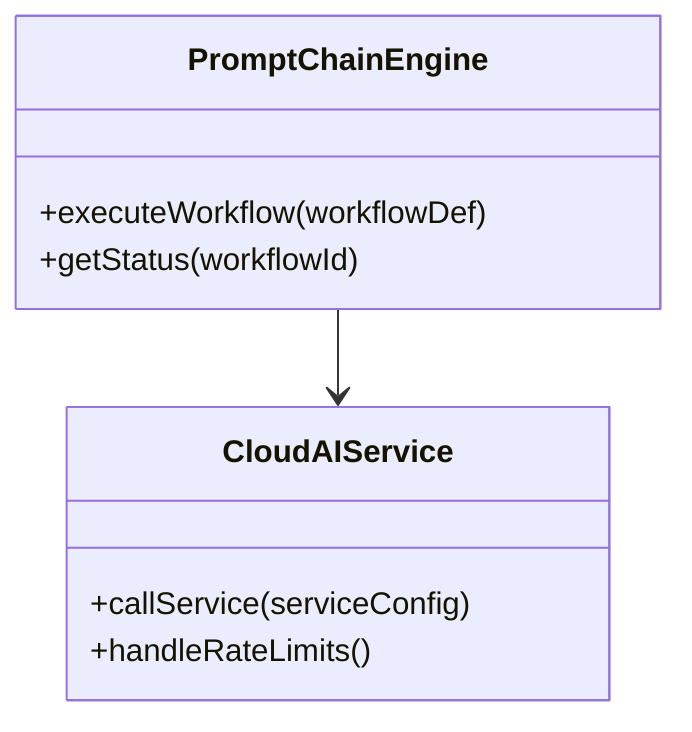

# Prompt Chain Engine Architecture (Cloud-Only)

## 1. JSON Workflow Definition Schema
```json
{
  "name": "content_creation_workflow",
  "version": "1.0",
  "variables": {
    "title": "Default Title",
    "author": "System"
  },
  "steps": [
    {
      "name": "content_generation",
      "type": "ai",
      "service": "deepseek-openrouter",
      "prompt": "Generate a blog post about {title}",
      "output_var": "generated_content",
      "fallback": {
        "action": "use_template",
        "template_id": "blog_default"
      }
    },
    {
      "name": "summary",
      "type": "ai",
      "service": "openai-gpt-4",
      "prompt": "Summarize this content: {generated_content}",
      "output_var": "summary",
      "timeout": 30
    }
  ]
}
```

## 2. Component Diagram


## 3. Security Considerations
1. **Cloud Provider Security**:
   - API key rotation
   - Request signing
   - TLS 1.3 enforcement

2. **Data Protection**:
   - No local model data persistence
   - Cloud provider data retention policies
   - GDPR-compliant logging

## 4. Implementation Plan
1. **Phase 1**: Core cloud integration (2 weeks)
2. **Phase 2**: Rate limiting (1 week)
3. **Phase 3**: Multi-provider fallback (1 week)