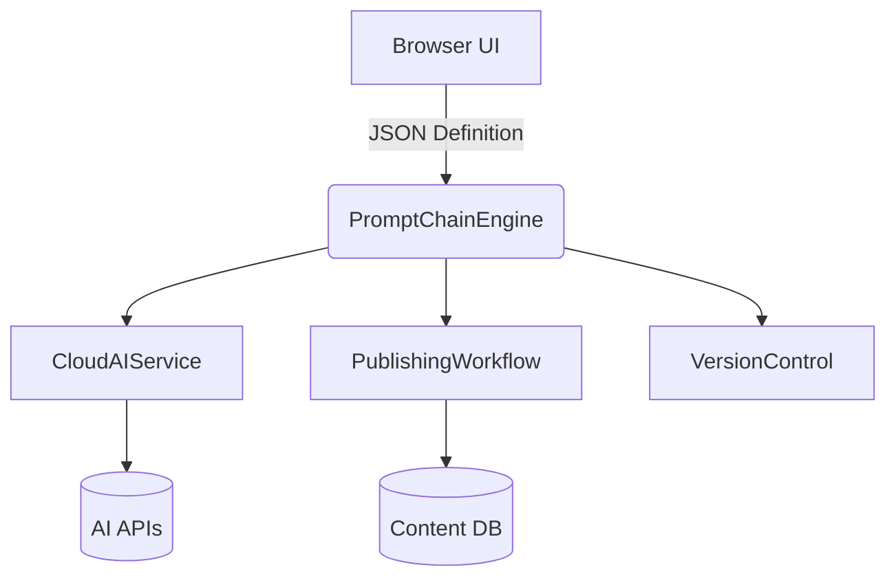

# Prompt Chain Engine Design

## Workflow Definition Schema
```json
{
  "name": "string",
  "description": "string",
  "variables": {
    "input": ["title", "keywords"],
    "output": ["content", "summary", "tags", "image_prompt"]
  },
  "steps": [
    {
      "name": "content_generation",
      "service": "ai/generate",
      "type": "title|expand|rewrite",
      "input_mapping": {
        "title": "{title}",
        "content": "{draft_content}"
      },
      "output_mapping": {
        "result": "generated_content"
      },
      "error_handling": {
        "retry": 3,
        "fallback": "default_content"
      }
    },
    {
      "name": "seo_optimization",
      "service": "ai/optimize",
      "depends_on": ["content_generation"]
    }
  ]
}
```

## Component Architecture


## Security Considerations
1. Input sanitization for all variables
2. Rate limiting per workflow step
3. JWT authentication for browser execution
4. Content validation before publishing
5. Logging all prompt/response pairs

## Integration Points
1. Existing AI services (`/api/ai/generate`)
2. Publishing workflow status system
3. Version control for content revisions
4. Memory-bank for prompt logging

## Implementation Roadmap
1. Extend PromptChainEngine.php with new schema support
2. Create UI workflow editor in admin panel
3. Add error recovery middleware
4. Implement secure proxy endpoint
5. Add memory-bank integration