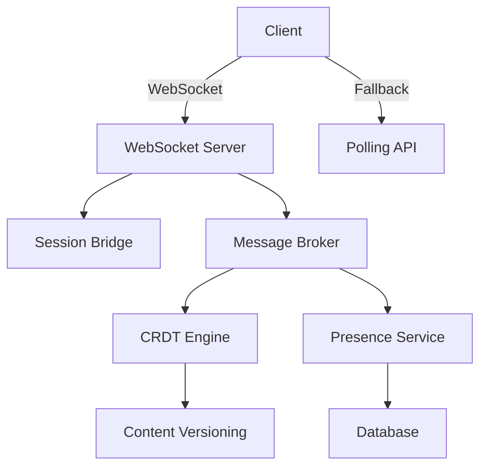
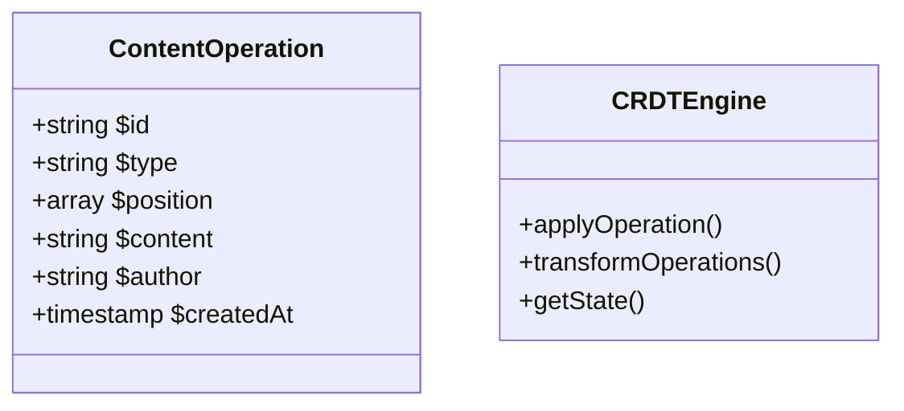

# Real-time Collaboration System Specification

## 1. System Overview


## 2. Core Components

### 2.1 WebSocket Server
- **File**: `includes/Realtime/WebSocketServer.php`
- **Protocol**: Ratchet (PHP WebSocket)
- **Features**:
  - 1000+ concurrent connections
  - Session token exchange
  - Graceful degradation detection

### 2.2 CRDT Engine


### 2.3 Presence Service
- **Storage**: Redis (primary), Database (fallback)
- **Tables**:
  ```sql
  CREATE TABLE `collaboration_sessions` (
    `session_id` VARCHAR(36) PRIMARY KEY,
    `user_id` VARCHAR(36),
    `document_id` VARCHAR(36),
    `last_active` TIMESTAMP,
    `metadata` JSON
  );
  ```

## 3. API Endpoints

### 3.1 WebSocket Negotiation
`POST /api/v2/realtime/connect`
```json
{
  "document_id": "doc_123",
  "session_token": "encrypted_token"
}
```

### 3.2 Polling Fallback
`GET /api/v2/realtime/poll?document_id=doc_123&last_operation=op_456`
```json
{
  "operations": [],
  "presence": [],
  "heartbeat": 123456789
}
```

## 4. Database Schema
```sql
CREATE TABLE `content_operations` (
  `id` VARCHAR(36) PRIMARY KEY,
  `document_id` VARCHAR(36),
  `operation_type` ENUM('insert','delete','format'),
  `position` JSON,
  `content` TEXT,
  `author_id` VARCHAR(36),
  `timestamp` BIGINT,
  `vector_clock` JSON
);
```

## 5. Performance Optimization
- Connection pooling
- Delta updates (only changed content)
- Operation batching (100ms intervals)
- Load testing plan for 500+ users

## 6. Implementation Phases
1. WebSocket core + fallback API
2. CRDT engine integration  
3. Presence tracking
4. Performance optimization
5. Load testing