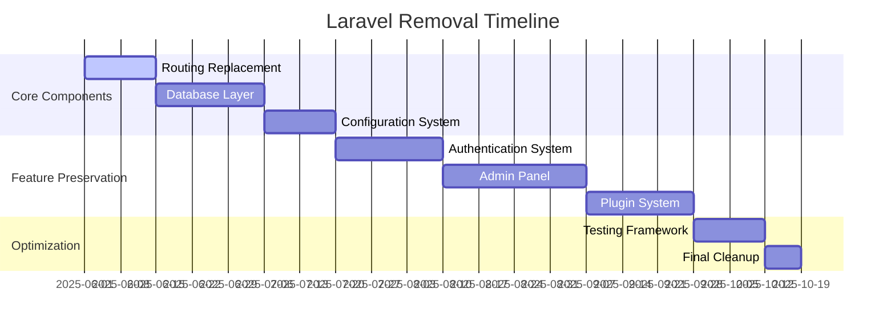

# Laravel Removal Plan v2

## 1. Prioritization (Phased Approach)

## 2. Replacement Strategies

### Core Components
| Laravel Component | Replacement Strategy | Implementation Notes |
|-------------------|----------------------|----------------------|
| Eloquent ORM | Custom PDO wrapper + Active Record pattern | Implement in `includes/Database/` |
| Routing | Existing `Router.php` + enhancements | Already partially implemented |
| Blade Templates | Plain PHP templates + simple inheritance | Use `include`/`require` with variables |
| Facades | Direct class instantiation + DI container | Simple service locator pattern |
| Configuration | INI/JSON files + custom loader | Replace `config()` helper |
| Helpers | Custom implementations | Create `includes/Helpers/` |

### Database Layer
1. Replace Eloquent with:
   - Basic Active Record implementation
   - PDO wrapper with query builder
   - Simple migration system using raw SQL files

### Authentication
1. Replace Laravel Auth with:
   - Session-based authentication
   - Custom role/permission system
   - JWT for API endpoints

## 3. Key Areas of Focus

1. **Critical Path**:
   - `app/` directory restructure
   - `database/` migration conversion
   - `routes/` to use custom router

2. **High Risk Areas**:
   - Database relationships
   - Queue system replacement
   - Testing framework

## 4. Potential Challenges

| Challenge | Mitigation Strategy |
|-----------|---------------------|
| Database schema changes | Maintain compatibility layer during transition |
| Complex relationships | Implement simple join system in DBAL |
| Queue processing | Use database-backed queue table |
| Testing framework | Simple PHPUnit setup + custom assertions |

## 5. Testing Approach

1. **Unit Testing**:
   - Basic PHPUnit setup
   - Mock database layer

2. **Integration Testing**:
   - Test critical workflows
   - Verify shared hosting constraints

3. **Deployment Testing**:
   - FTP deployment verification
   - Permission checks

## 6. Phased Rollout

1. **Phase 1: Core Replacement (4 weeks)**
   - Routing system
   - Database layer
   - Configuration system

2. **Phase 2: Feature Preservation (6 weeks)**
   - Authentication
   - Admin panel
   - Plugin system

3. **Phase 3: Optimization (3 weeks)**
   - Testing framework
   - Performance tuning
   - Final cleanup