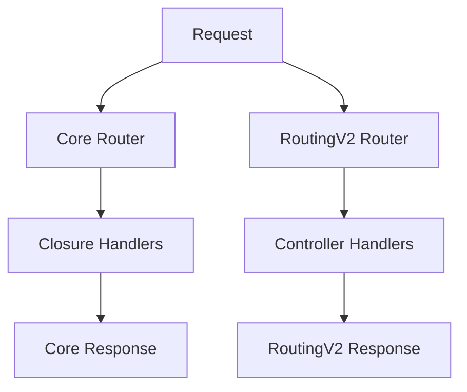
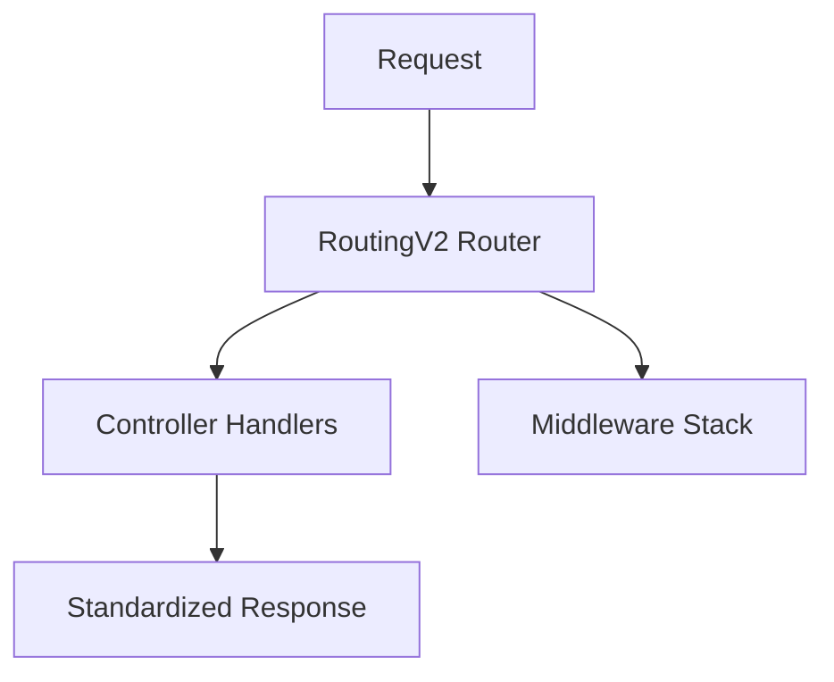

# Routing System Standardization Plan

## Current Architecture Analysis

## Proposed Unified Architecture

## Implementation Phases

### Phase 1: Documentation & Preparation
- Document current routing patterns
- Create adapter for Core Router compatibility
- Update developer documentation

### Phase 2: Core Route Migration
- Convert web.php routes to controllers
- Implement middleware support
- Add CSRF protection middleware

### Phase 3: Admin Route Cleanup
- Standardize parameter handling
- Unify response formats
- Optimize permission middleware

### Phase 4: Testing & Validation
- Create test cases
- Benchmark performance
- Update CI/CD pipelines

## Timeline
- Phase 1: 1 week
- Phase 2: 2 weeks
- Phase 3: 1 week
- Phase 4: 1 week

## Risk Mitigation
- Maintain backwards compatibility
- Create rollback procedures
- Document migration path