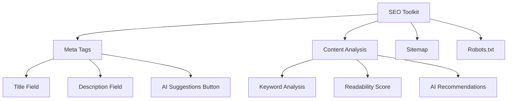

# SEO Toolkit Implementation Plan

## File Structure
```
admin/seo/
  ├── SeoToolkit.vue (main component)
  ├── seo-api.php (backend handlers)
  └── seo.css (optional styles)
```

## Core Features
1. **Meta Tag Management**
   - Title, description, keywords
   - OpenGraph/Twitter cards
   - AI-generated suggestions

2. **Content Analysis**
   - Keyword density
   - Readability score
   - AI-powered recommendations

3. **Sitemap Generator**
   - Automatic sitemap.xml creation
   - Priority/change frequency settings

4. **Robots.txt Editor**
   - Visual editor with validation

## UI Components


## AI Integration Points
1. Meta Tag Generation
   - Uses `AIClient::execute()` with prompt:
     "Generate SEO meta tags for a page about [topic] with focus keywords [keywords]"

2. Content Optimization
   - Uses `AIClient::execute()` with prompt:
     "Analyze this content for SEO improvements: [content]"

3. Sitemap Suggestions
   - Uses `AIClient::execute()` with prompt:
     "Suggest important pages to include in sitemap for [site purpose]"

## Implementation Steps
1. Create Vue component scaffold
2. Implement core meta tag management
3. Add AI integration points
4. Build content analysis tools
5. Implement sitemap generator
6. Add robots.txt editor
7. Test and refine