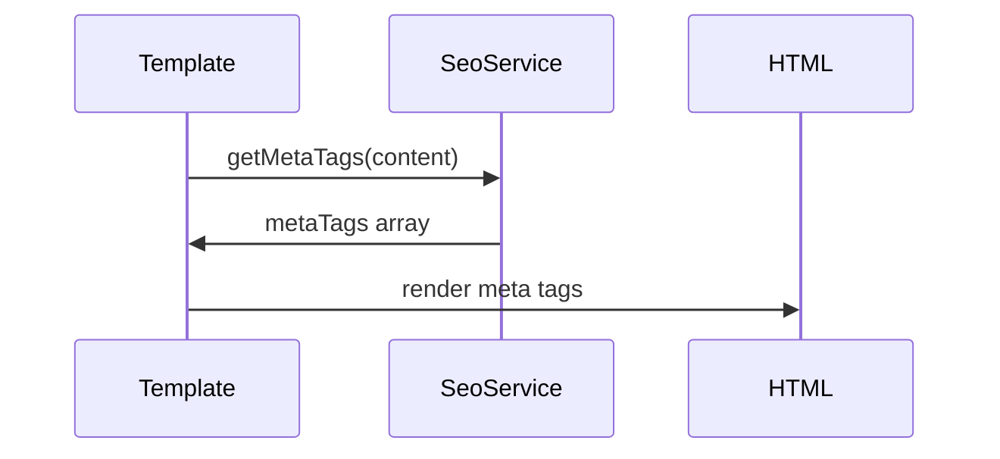

# SEO Engine Implementation Plan

## Core Components

### 1. SeoService Class (`services/SeoService.php`)
```php
class SeoService {
    // Content analysis
    public function analyzeContent(string $content): array;
    public function calculateReadability(string $content): float;
    
    // Meta generation
    public function generateMetaTags(array $contentData): array;
    
    // Keyword analysis
    public function extractKeywords(string $content): array;
    public function compareWithCompetitors(array $urls): array;
}
```

### 2. Template Integration (`includes/TemplateProcessor.php`)


### 3. Editor Integration (`admin/editor/SeoPanel.vue`)
```javascript
// Vue component for SEO suggestions
export default {
    props: ['content'],
    methods: {
        getSeoSuggestions() {
            // Call SeoService via API
        }
    }
}
```

## Implementation Phases

1. **Phase 1: Core Service (2 days)**
   - Implement base SeoService class
   - Add content scoring
   - Basic meta generation

2. **Phase 2: Template Integration (1 day)**
   - Template helpers
   - Meta tag rendering
   - Structured data

3. **Phase 3: Editor UI (2 days)**
   - SEO suggestions panel
   - Real-time scoring
   - Optimization tips

## Testing Approach
1. Unit tests for scoring algorithms
2. Integration tests for template rendering
3. Browser tests for editor UI