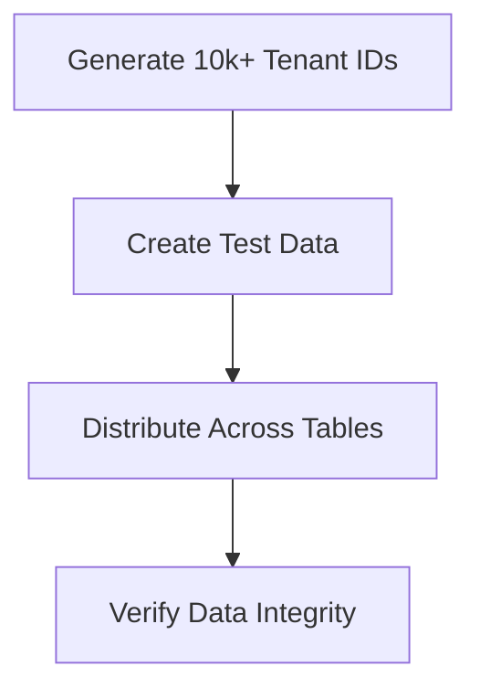

# Tenant ID Conversion Benchmark Architecture

## 1. Data Generation Strategy

- **Source Data**: 
  - Current tenant IDs (VARCHAR(36) UUIDs from production)
  - New tenant ID format (to be determined)
- **Generation Method**:
  - PHP script using `random_bytes()` for UUID generation
  - Batch insert via prepared statements
- **Distribution**:
  - Evenly distribute across all tenant-specific tables
  - Maintain referential integrity

## 2. Performance Metrics to Capture
| Metric | Measurement Method | Target |
|--------|--------------------|--------|
| Conversion Time | PHP microtime() | < 5ms per 1000 records |
| Memory Usage | memory_get_usage() | < 50MB peak |
| Query Performance | EXPLAIN ANALYZE | < 100ms per query |
| Index Efficiency | SHOW INDEX STATS | > 90% hit rate |

## 3. Test Execution Plan
1. **Pre-test Setup**:
   - Create test database snapshot
   - Generate 10k tenant records with relationships
   - Warm up database caches

2. **Test Phases**:
   - **Baseline**: Measure current performance
   - **Conversion**: Run ID conversion process
   - **Post-conversion**: Verify performance

3. **Test Cases**:
   - Single tenant conversion
   - Bulk conversion (1000+ tenants)
   - Mixed workload during conversion

## 4. Resource Requirements
- **Database**: Dedicated test instance with production-like specs
- **PHP**: 8.1+ with OPcache enabled
- **Memory**: Minimum 512MB allocated
- **Storage**: 2x current production data size

## 5. Expected Outcomes
- Performance baseline for current implementation
- Conversion time estimates for full production rollout
- Identification of potential bottlenecks
- Recommended optimization strategies