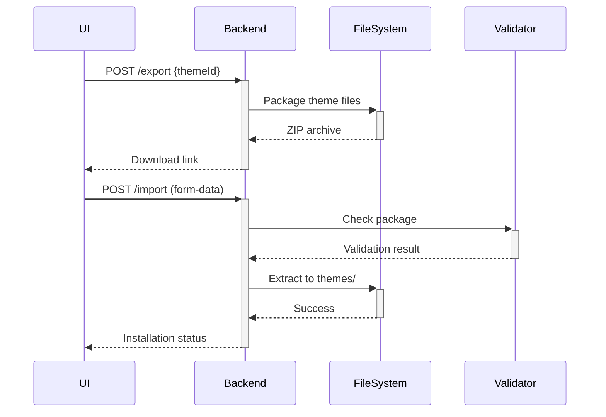

# Theme Export/Import System Proposal

## Package Structure
```
theme-name.zip
├── theme.json        # Required metadata
├── templates/        # PHP template files
│   └── layout.php    # Main template
├── assets/           # CSS/JS resources
└── versions/         # Optional version history
    └── v1.0.0.json
```

## Implementation Requirements

1. **Backend API Endpoints**:
   - POST `/api/themes/export` - Generates ZIP package
   - POST `/api/themes/import` - Validates and installs theme

2. **Security Measures**:
   - Validate file types/extensions
   - Scan for PHP execution in unexpected files
   - Limit package size (10MB max)

3. **UI Integration**:


4. **theme.json Specification**:
```json
{
  "name": "Theme Name",
  "version": "1.0.0",
  "description": "",
  "author": "",
  "requires": {
    "cms": ">=2.0.0"
  }
}
```

## Development Tasks
1. Implement ZIP packaging in ThemeBuilder.php
2. Add import validation logic
3. Extend ThemeManager.vue with export/import UI
4. Create theme.json template
5. Add documentation to theme_testing_procedures.md