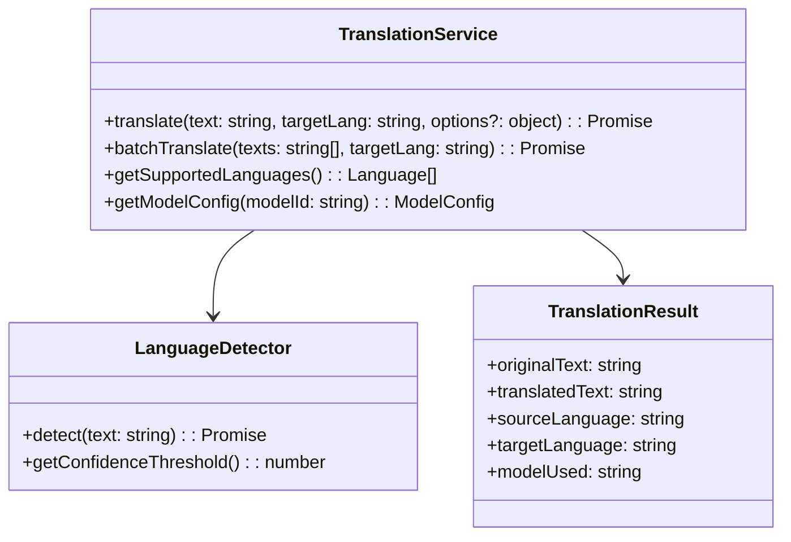

# AI Translation Layer Implementation Plan

## 1. Class Structure



## 2. API Endpoint Specification

### POST /api/ai/translation/translate
```json
{
  "text": "string",
  "target_language": "string",
  "source_language": "string|null",
  "model_preference": "string|null",
  "options": {
    "preserve_formatting": "boolean",
    "formal_tone": "boolean"
  }
}
```

### GET /api/ai/translation/languages
Returns supported languages and models

## 3. AI Integration Points

```php
// config/ai_translation_models.php
return [
    'gemini_pro' => [
        'api_endpoint' => 'https://generativelanguage.googleapis.com/v1beta/models/gemini-pro:generateContent',
        'languages' => ['en', 'es', 'fr', 'de', 'it', 'pt', 'nl', 'ru', 'ja', 'zh'],
        'context_window' => 32768
    ],
    'mistral_large' => [
        'api_endpoint' => 'https://api.mistral.ai/v1/chat/completions',
        'languages' => ['en', 'es', 'fr', 'de', 'it', 'pt'],
        'fast_mode' => true
    ]
];
```

## 4. Frontend Requirements

```javascript
// admin/components/TranslationWidget.vue
{
  props: ['content'],
  data() {
    return {
      targetLanguage: 'es',
      translationInProgress: false,
      translatedContent: ''
    }
  },
  methods: {
    async translate() {
      this.translationInProgress = true;
      const { data } = await axios.post('/api/ai/translation/translate', {
        text: this.content,
        target_language: this.targetLanguage
      });
      this.translatedContent = data.translatedText;
      this.translationInProgress = false;
    }
  }
}
```

## 5. Implementation Phases

1. **Core Services**:
   - TranslationService base class
   - LanguageDetector implementation
   - Model configuration

2. **API Layer**:
   - REST endpoints
   - Rate limiting
   - Tenant isolation

3. **Frontend Integration**:
   - Translation UI components
   - Content editor integration
   - Batch translation

4. **Workflow Automation**:
   - Content workflow hooks
   - Auto-translation rules
   - Quality estimation