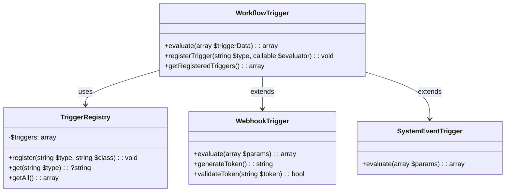

# Trigger System Expansion Plan

## Overview
Extend the workflow trigger system to support:
1. System events
2. Custom triggers
3. Scheduled triggers
4. Webhooks
While maintaining backward compatibility.

## Architecture

## Implementation Tasks

### 1. Extend WorkflowTrigger.php
- Add dynamic trigger registration system
- Support new trigger types:
  - System events (database changes, cron jobs)
  - Custom triggers (user-defined conditions)
  - Enhanced scheduled triggers
  - Webhook integration
- Maintain backward compatibility layer

### 2. Create TriggerRegistry.php
- Singleton pattern for trigger management
- Methods:
  - `register()` - Add new trigger types
  - `get()` - Retrieve trigger handler
  - `getAll()` - List registered triggers

### 3. Implement Webhook Endpoint
- Location: `/api/webhook/{token}`
- Features:
  - Token generation/validation
  - Payload verification
  - Workflow triggering
  - Rate limiting

### 4. Backward Compatibility
- Deprecation warnings for old format
- Automatic conversion layer
- Documentation of changes

### 5. Trigger Tester
- Add to workflow dev console:
  - Test trigger conditions
  - Preview payloads
  - Simulate events
  - Validate webhooks

## Documentation
File: `memory-bank/trigger_system.md`
- Trigger types and usage
- Registration process
- Webhook setup
- Testing procedures
- Migration guide

## FTP Compatibility
- All changes maintain FTP deployment support
- No CLI dependencies
- Atomic file operations

## PHP 8.1+ Requirements
- Typed properties
- Union types
- Named arguments (optional)