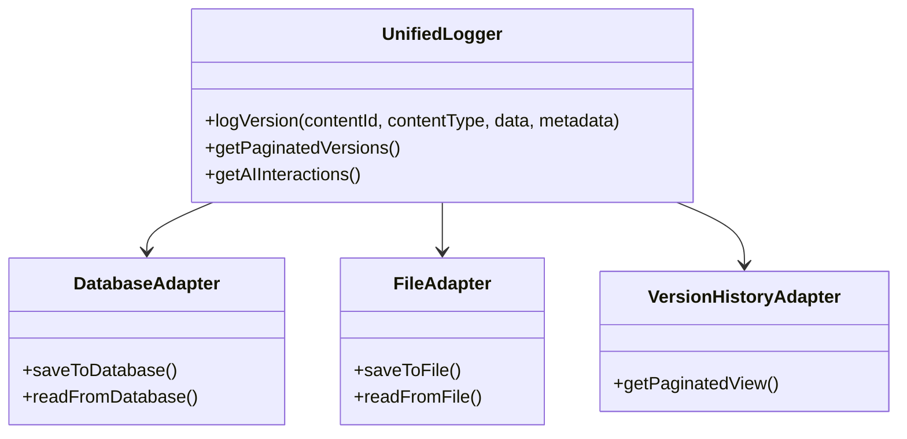

# Unified Logging Solution

## Problem Statement
Current logging systems are inconsistent:
1. `VersionHistory` - Paginated view with test data
2. `ContentVersioningSystem` - Database-backed versioning
3. `AIFeedbackLogger` - JSON file logging for AI interactions

## Solution Architecture



## Implementation Steps

1. **Database Schema Changes**
```sql
ALTER TABLE content_versions
ADD COLUMN ai_metadata JSON DEFAULT NULL,
ADD COLUMN log_type ENUM('content','ai','system') DEFAULT 'content';
```

2. **Core Components**
- `UnifiedLogger`: Main interface
- `DatabaseAdapter`: Handles database operations
- `FileAdapter`: Maintains file logging compatibility
- `VersionHistoryAdapter`: Provides paginated views

3. **Migration Strategy**
- Phase 1: Add new columns, maintain dual logging
- Phase 2: Migrate existing AI logs to database
- Phase 3: Deprecate old systems

4. **Backward Compatibility**
- Keep existing method signatures
- Add deprecation warnings
- Provide migration scripts

## Testing Plan
1. Unit tests for new components
2. Integration tests for migration
3. Performance tests for pagination
4. Backward compatibility tests

## Timeline
1. Design approval - 1 day
2. Implementation - 3 days
3. Testing - 2 days
4. Deployment - 1 day