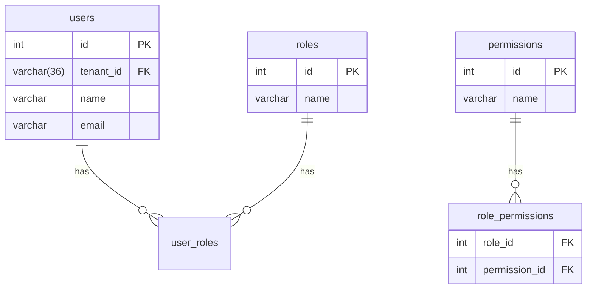

# User Management Implementation Plan

## Overview
Implement comprehensive user management in admin module including:
- User CRUD operations
- Role management
- Permission management
- Role-permission assignments
- User-role assignments

## Database Schema Verification


## Implementation Steps

### 1. Admin Module Structure
```
modules/admin/
├── controllers/
│   ├── UserController.php
│   ├── RoleController.php
│   └── PermissionController.php
├── views/
│   ├── users/
│   │   ├── index.php
│   │   └── form.php
│   ├── roles/
│   │   └── index.php
│   └── permissions/
│       └── index.php
└── routes.php
```

### 2. Required Routes
```php
// modules/admin/routes.php
$router->add('/admin/users', 'UserController@index');
$router->add('/admin/users/create', 'UserController@create');
$router->add('/admin/users/{id}/edit', 'UserController@edit');
$router->add('/admin/users/{id}/delete', 'UserController@delete');

$router->add('/admin/roles', 'RoleController@index');
$router->add('/admin/roles/create', 'RoleController@create');

$router->add('/admin/permissions', 'PermissionController@index');
```

### 3. Security Implementation
- CSRF protection for all forms
- Role-based access control
- Input validation/sanitization
- Password hashing (bcrypt)

### 4. Testing Plan
- Unit tests for controllers
- Integration tests for API endpoints
- UI tests for admin interface
- Security penetration testing

## Timeline
1. Database verification - 1 day
2. Core implementation - 3 days
3. Security implementation - 2 days
4. Testing - 2 days