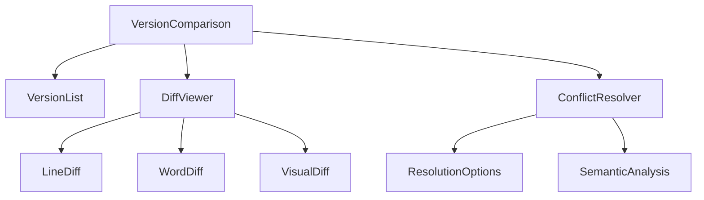

# Version Comparison Enhancement Plan

## 1. API Endpoints Enhancement
- Add `/api/version-control/compare/{baseVersionId}/{compareVersionId}/semantic` endpoint for semantic diff analysis
- Create `/api/version-control/compare/{baseVersionId}/{compareVersionId}/visual` for visual diff representation
- Implement `/api/version-control/compare/{baseVersionId}/{compareVersionId}/summary` for change summaries

## 2. React Component Architecture

## 3. Database Schema Modifications
- Add `semantic_changes` table to track semantic diff metadata
- Add `visual_diff_cache` table for storing pre-rendered visual diffs
- Add `version_comparison_metrics` for tracking comparison performance

## 4. CMS Integration Points
- Hook into content editor's version history panel
- Add comparison button in version dropdown
- Integrate with content moderation workflow

## 5. Testing Strategy
- Unit tests for diff algorithms
- Integration tests for API endpoints
- Visual regression tests for diff rendering
- Performance benchmarks for large content comparison

## 6. Performance Considerations
- Implement chunked diff processing
- Add background job for pre-computing complex diffs
- Cache frequent comparisons
- Optimize for mobile with reduced DOM operations

## 7. Security Requirements
- Validate version ownership before comparison
- Rate limit comparison endpoints
- Sanitize HTML content before rendering
- Implement CSRF protection for merge operations

## 8. Documentation Needs
- API documentation for new endpoints
- User guide for comparison features
- Developer guide for extending diff algorithms
- Performance tuning recommendations

## 9. Deployment Plan
- Database migrations first
- Backend API updates
- Frontend component rollout
- Monitoring for comparison performance

## 10. Rollback Procedures
- Database migration rollback scripts
- Feature flag for new comparison UI
- API versioning for backward compatibility
- Emergency rollback checklist