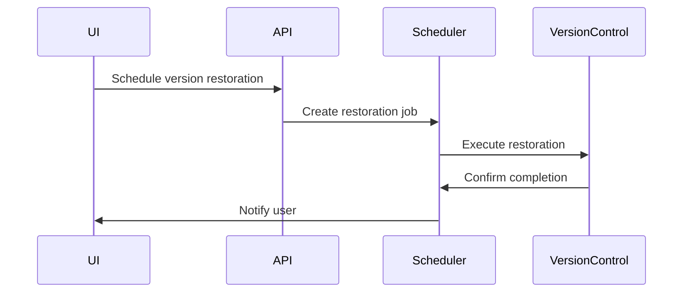

# Version Control System Implementation Plan

## 1. Database Schema Updates
- Align restoration.php with new tables (versions, version_content)
- Add restoration tracking columns to version_metadata:
  ```sql
  ALTER TABLE version_metadata
  ADD COLUMN restored_by INT NULL,
  ADD COLUMN restored_at DATETIME NULL,
  ADD FOREIGN KEY (restored_by) REFERENCES users(id)
  ```

## 2. API Implementation
### Endpoints:
- `GET /api/v1/versions/{id}/diff` - View version differences
- `POST /api/v1/versions/{id}/restore` - Restore specific version
- `GET /api/v1/versions/{id}/restorations` - View restoration history

### RBAC Requirements:
- `content.version.view` - View versions/diffs
- `content.version.restore` - Restore versions
- `content.version.history` - View restoration history

## 3. Scheduling Integration


## 4. UI Components
1. Version History Panel:
   - Restoration action button
   - Visual diff viewer
   - Restoration history timeline

2. Scheduling Dialog:
   - New "Restore Version" option
   - Conflict detection warnings
   - Restoration preview

## Implementation Phases

### Phase 1: Core Restoration (2 days)
- Database schema updates
- Basic API endpoints
- Simple restoration flow

### Phase 2: Scheduling Integration (1 day)
- Add restoration to scheduling options
- Conflict detection
- Notification system

### Phase 3: UI Enhancements (1 day)
- Version comparison tools
- Restoration history view
- Scheduled restoration tracking

## Testing Requirements
1. Unit Tests:
   - Version restoration integrity
   - Permission validation
   - Conflict detection

2. Integration Tests:
   - Scheduled restoration workflow
   - Notification system
   - UI interaction flows