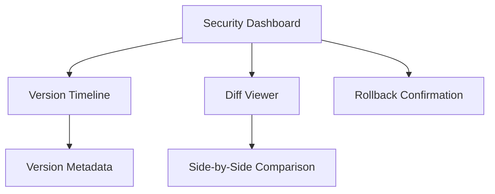

# Version Control Integration Plan

## 1. Core Components
- **ContentVersioningSystem**: Existing version storage
- **DiffVisualizer**: Enhanced comparison tool
- **RollbackManager**: Version restoration handler
- **RevisionHistory**: Audit logging system

## 2. API Endpoints
```markdown
### Version Management
- GET `/admin/security-dashboard.php?action=list_versions`
- POST `/admin/security-dashboard.php?action=create_version`
- GET `/admin/security-dashboard.php?action=get_version`

### Comparison
- GET `/admin/security-dashboard.php?action=compare_versions`

### Rollback
- POST `/admin/security-dashboard.php?action=rollback_version`
```

## 3. UI Components


## 4. Implementation Phases
1. **Phase 1**: API Endpoints (2 days)
2. **Phase 2**: UI Components (3 days)
3. **Phase 3**: Audit Integration (1 day)
4. **Phase 4**: Testing (2 days)

## 5. Security Considerations
- Permission validation for all operations
- Rate limiting on rollback endpoints
- Encrypted audit logs
- Content validation before version creation