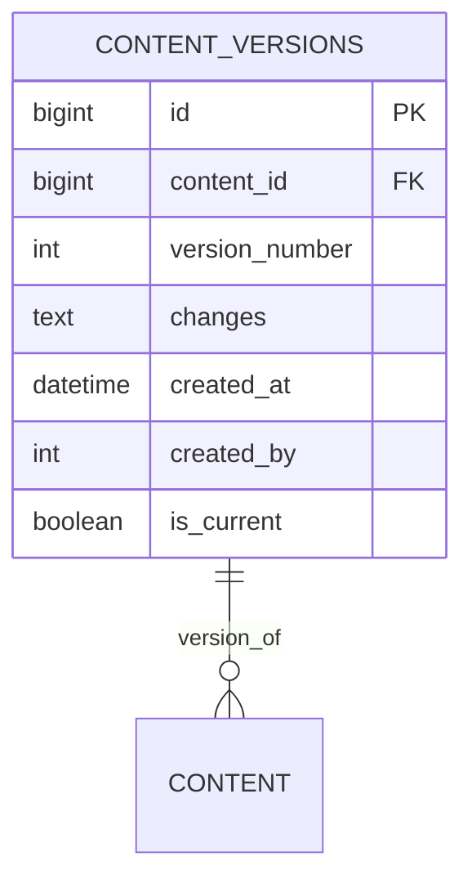

# Version Control System Standardization Plan

## Objective
Create a unified version control system for content management with:
- Standardized schema
- Consistent migration patterns
- Web-accessible testing endpoints

## Schema Design


## Migration Components
1. **New Table Creation**:
   ```sql
   CREATE TABLE content_versions (
       id BIGINT PRIMARY KEY AUTO_INCREMENT,
       content_id BIGINT NOT NULL,
       version_number INT NOT NULL,
       changes TEXT NOT NULL,
       created_at DATETIME DEFAULT CURRENT_TIMESTAMP,
       created_by INT NOT NULL,
       is_current BOOLEAN DEFAULT FALSE,
       FOREIGN KEY (content_id) REFERENCES content(id)
   );
   ```

2. **Indexes**:
   ```sql
   CREATE INDEX idx_content_versions_content ON content_versions(content_id);
   CREATE INDEX idx_content_versions_current ON content_versions(is_current);
   ```

## Implementation Steps
1. Create migration file: `2025_phase9_content_versions.php`
2. Implement web endpoints:
   - `/api/migrate/content_versions`
   - `/api/rollback/content_versions` 
   - `/api/test/content_versions`

## Testing Protocol
1. Verify table creation
2. Test version insertion
3. Validate foreign key constraints
4. Check rollback functionality

## Timeline
- Schema Finalization: 1 day
- Migration Development: 2 days
- Testing: 1 day
- Deployment: 0.5 day