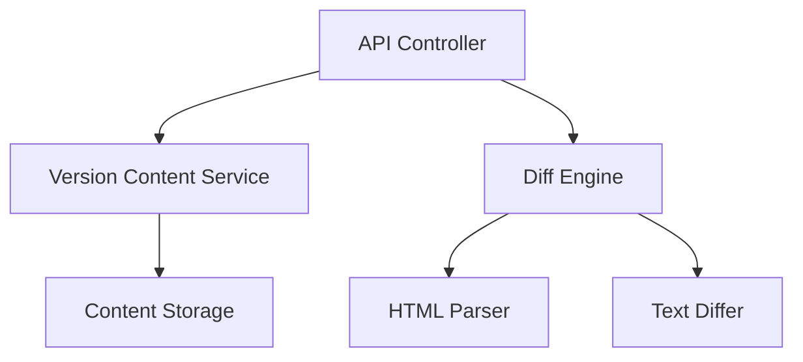

# Version Comparison System Implementation Plan

## Core Components

1. **API Endpoints**
   - `/api/versions/compare/{v1}/{v2}` (JSON response)
   - `/api/versions/html-diff/{v1}/{v2}` (HTML response)

2. **Backend Architecture**


3. **Implementation Steps**

### Phase 1: API Implementation
- Create `VersionComparisonController.php`
- Implement REST endpoints
- Add version content retrieval

### Phase 2: Diff Engine
- Create `ContentDiffEngine.php`
- Implement:
  - Line-based diff (Myers algorithm)
  - HTML-aware comparison
  - Change statistics

### Phase 3: UI Integration
- Update client-side JS
- Add HTML diff rendering
- Enhance view modes

## File Structure
```
/api/versions/
  ComparisonController.php
/includes/Diff/
  ContentDiffEngine.php
  HtmlDiff.php
  TextDiff.php
```

## Technical Requirements
- PHP 8.1+ compatible
- No external dependencies
- FTP-deployable
- Shared hosting compatible