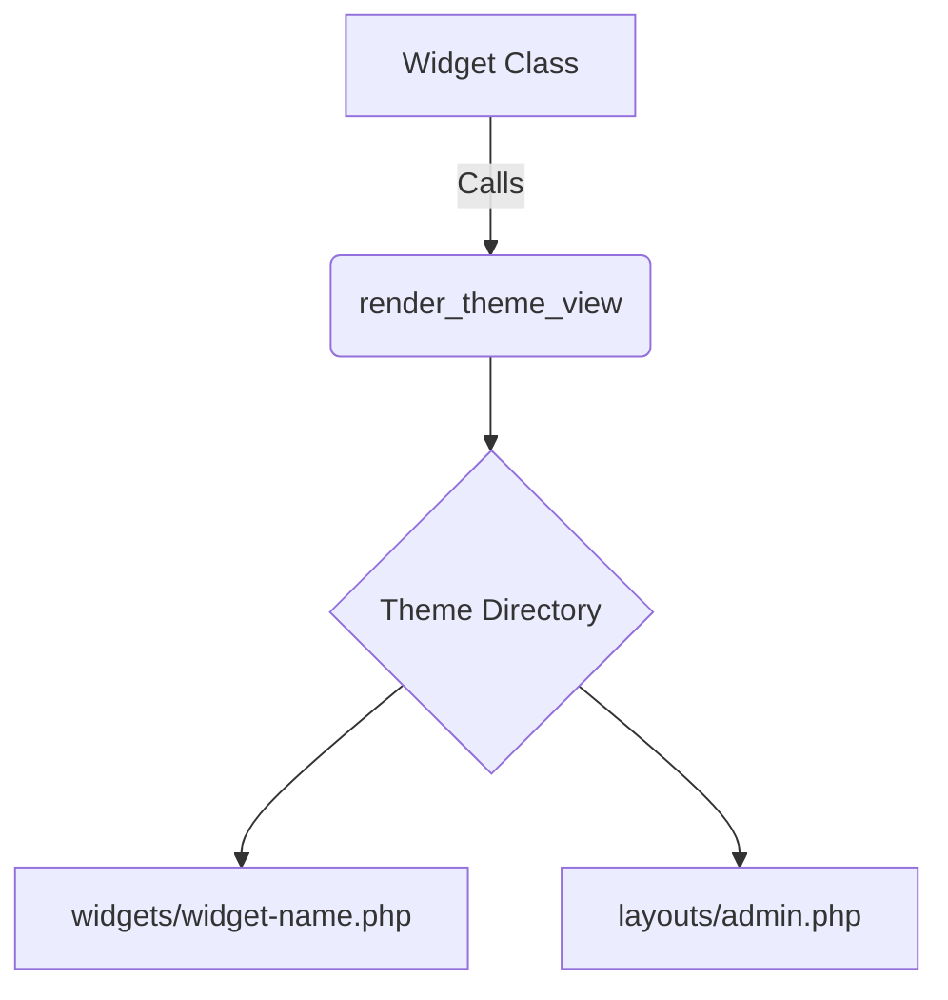

# Widget Template Standardization Plan

## Current State Analysis
- Widgets render HTML directly in PHP classes
- No separation of concerns between logic and presentation
- Theme system has partial template support (missing admin theme layouts)

## Proposed Solution

1. **Template Structure**:

2. **Implementation Steps**:
- Create `widgets/` directory in all theme folders
- Move widget HTML from PHP classes to template files
- Extend `render_theme_view()` to support:
  - Widget-specific templates
  - Layout fallback chains
  - Template variable passing

3. **Backward Compatibility**:
- Maintain current widget rendering as fallback
- Add deprecation warnings for direct HTML rendering

## Migration Checklist
- [ ] Create template directories in themes
- [ ] Update theme renderer
- [ ] Migrate widget HTML to templates
- [ ] Update documentation