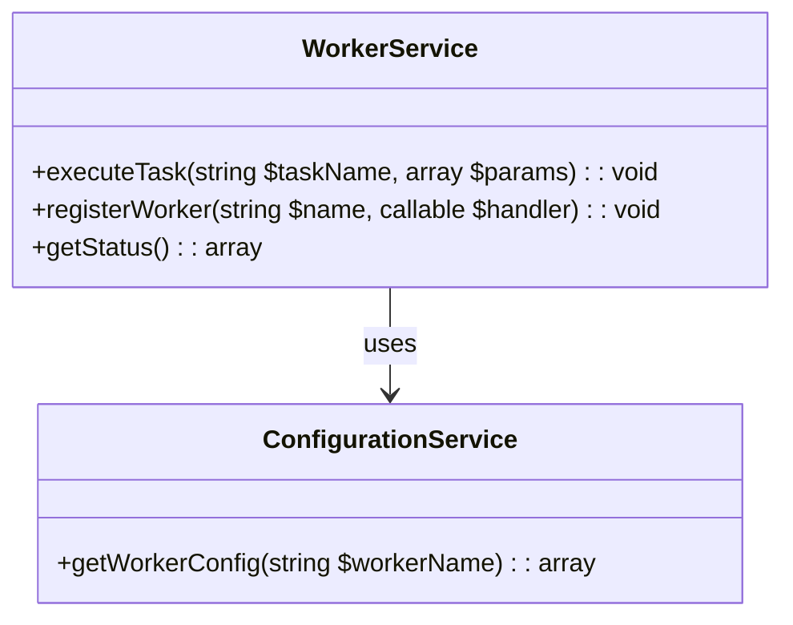

# WorkerService Consolidation Plan

## Overview
Consolidate 125 worker-related files into a unified WorkerService with:
- Dependency injection support
- Configuration management integration
- Backward compatibility layer

## Architecture

## Implementation Phases

1. **Core Service Creation**
   - Create WorkerService.php with DI container support
   - Implement base worker registration system

2. **Configuration Integration**
   - Connect with ConfigurationService
   - Implement config-based worker initialization

3. **Backward Compatibility**
   - Create adapter layer for existing workers
   - Deprecation notices for old patterns

4. **Testing**
   - Unit tests for core functionality
   - Integration tests with existing workers
   - Web-accessible test endpoints

## Timeline
- Phase 1: 3 days
- Phase 2: 2 days  
- Phase 3: 4 days
- Phase 4: 3 days

## Requirements
- PHP 8.1+ compatibility
- No CLI dependencies
- Shared hosting support
- PSR-4 autoloading