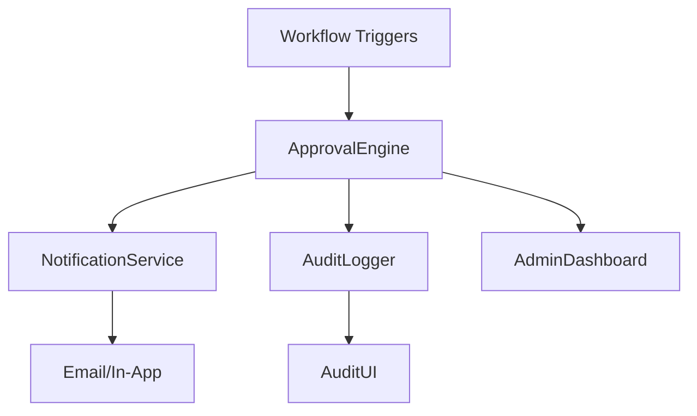

# Workflow Automation Consolidated Plan

## Current Implementation Status
- Basic workflow functionality (ApprovalEngine) exists
- Core API endpoints operational
- Frontend components created
- Validation implemented

## Remaining Work Items
- Notification system (event listeners, templates, delivery methods)
- Audit logging (schema, logging implementation, viewer UI)
- Comprehensive testing (edge cases, performance, notifications)

## Database Schema
- Existing `workflows` table
- New `workflow_triggers` and `workflow_actions` tables
- `workflow_events` table for logging

## Proposed 5 Milestones
1. Notification System Implementation (2 weeks)
2. Audit Logging System (1.5 weeks)
3. Admin Dashboard Enhancements (1 week)
4. Comprehensive Testing Suite (1.5 weeks)
5. Documentation & Final Integration (1 week)

## Integration Points
- AI Service Connectors
- n8n Webhook Support
- CMS Event System
- Version Control System

## Next Steps
1. Implement NotificationService class
2. Create database migrations for new tables
3. Build AuditLogger service
4. Develop Admin Dashboard components
5. Write comprehensive test suite