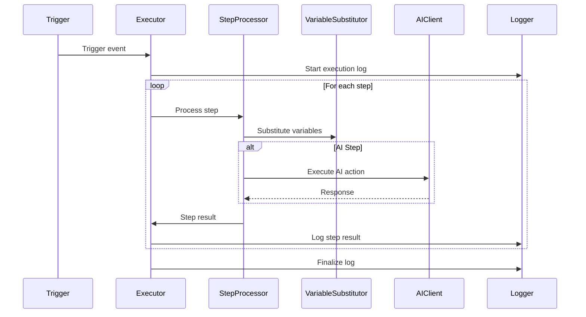

# Workflow Execution Engine Implementation Plan

## Core Components

1. **WorkflowExecutor** (`core/WorkflowExecutor.php`)
   - Main execution controller
   - Loads workflow JSON schema
   - Manages step execution order
   - Handles timeouts and retries
   - Coordinates with other components

2. **WorkflowStepProcessor** (`core/WorkflowStepProcessor.php`)
   - Processes individual steps
   - Handles different step types (condition, action, etc)
   - Manages step inputs/outputs
   - Implements timeout handling

3. **VariableSubstitutor** (`core/VariableSubstitutor.php`)
   - Handles {variable} substitution
   - Maintains execution context
   - Supports nested variables
   - Validates variable references

4. **AIClient** (`core/AIClient.php`)
   - Interfaces with OpenRouter API
   - Handles authentication
   - Manages token substitution in prompts
   - Implements retry logic

5. **WorkflowLogger** (`core/WorkflowLogger.php`)
   - Writes execution logs
   - Formats log entries
   - Manages log rotation
   - Stores in `/storage/workflow_logs/`

## Execution Flow



## API Endpoint (`public/api/workflows/run.php`)
- Accepts POST requests
- Parameters:
  - `workflow_id` (required)
  - `input_vars` (JSON object)
- Returns:
  - Execution ID
  - Status
  - Error messages (if any)

## Error Handling
- Timeout detection
- Invalid variable references
- API call failures
- Invalid workflow schema
- Permission checks

## Logging Format
```json
{
  "execution_id": "uuid",
  "workflow_id": 123,
  "start_time": "timestamp",
  "end_time": "timestamp",
  "status": "completed|failed",
  "steps": [
    {
      "step_id": 1,
      "name": "step_name",
      "start_time": "timestamp",
      "end_time": "timestamp",
      "status": "success|failed",
      "output_vars": {},
      "error": null
    }
  ]
}
```

## Implementation Steps

1. Create directory structure:
   - `storage/workflow_logs/`
   - `public/api/workflows/`

2. Implement core classes:
   - WorkflowExecutor
   - WorkflowStepProcessor
   - VariableSubstitutor
   - AIClient
   - WorkflowLogger

3. Create API endpoint:
   - `public/api/workflows/run.php`

4. Integrate with WorkflowTrigger

5. Add test cases