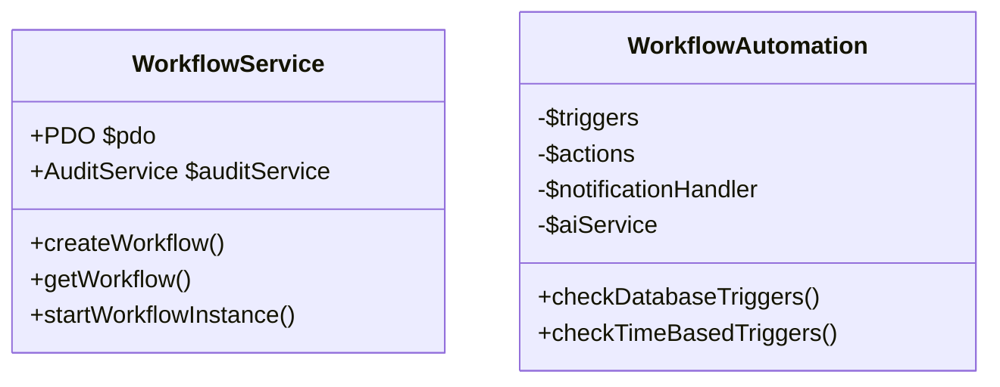
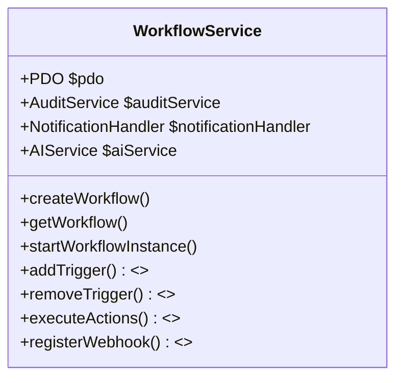

# Workflow Service Refactoring Plan

## Overview
Consolidate WorkflowAutomation.php functionality into WorkflowService.php to create a unified workflow management system.

## Current Architecture

## Proposed Changes
1. **Enhanced WorkflowService**:

2. **Implementation Phases**:
- **Phase 1**: Add new methods to WorkflowService
  - Trigger management system
  - Action execution framework
  - Webhook integration
- **Phase 2**: Migration
  - Create adapter for NotificationHandler
  - Port AI service integration
  - Update all references
- **Phase 3**: Deprecation
  - Mark WorkflowAutomation as deprecated
  - Create migration guide

3. **Backward Compatibility**:
- Keep WorkflowAutomation during transition
- Add @deprecated tags
- Log warnings for old class usage

4. **Testing Strategy**:
- Unit tests for new trigger system
- Integration tests with existing workflows
- Performance testing

## Implementation Notes
- Use existing AuditService for all logging
- Maintain current database schema
- Keep API signatures consistent